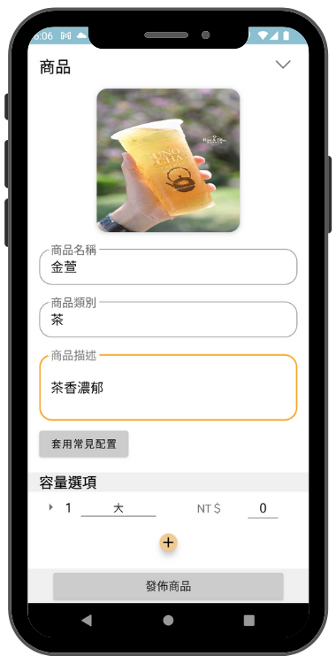
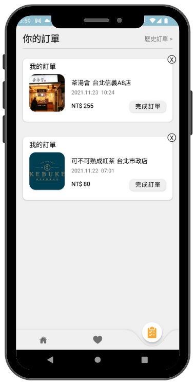
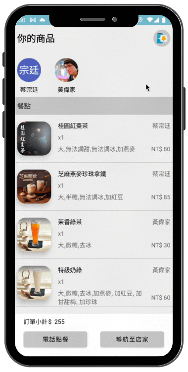
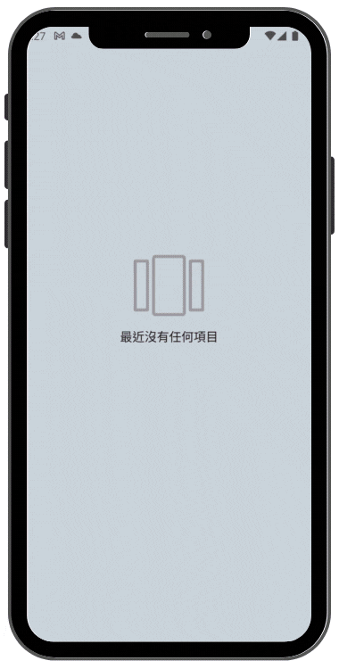
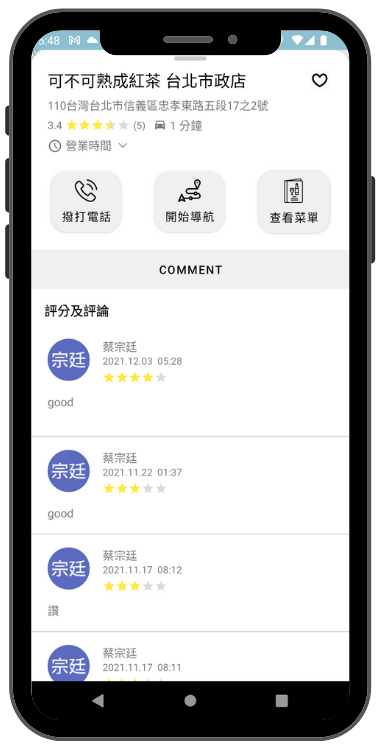

# 報茗牌 ShakeIt

    
    

A map that you can use several ways to search for nearby beverage shops which includes

your transportation, traffic time or filter out your favorite stores

then uses the menu system to create your orders. Also, you can share your orders by LINE messages

and send notifications to other members who make the order together

# 🧋Features

### Core features：

- Filter out the shop you like or search for the beverage you like
- Show your traffic time to the shop
- Navigation to the shop which you selected in the App
- Using menu system to create your order
- Leave a comment for the shop
- Share your orders with LINE messages
- Send notification to other members who make the order together

### ScreenShots：

- #### Home Page

>Filter out the shop and Search for the beverage 

 
&nbsp&nbsp
 

>Choose your transportation and setting your traffic time

 

> Start navigation ( Walking or Driving )

&nbsp&nbsp

> Add new shop

 

- #### Menu Page

> Select beverage which you want and choose amount of ice, sugar and capacity 

&nbsp&nbsp

 

> Share orders to your friends with LINE message

 

> Add new product

 

- #### Order Page

> Check and edit your order

&nbsp&nbsp

 

> Send notifications to other members who make the order together by FCM service

&nbsp&nbsp

> Complete order and leave comment 

&nbsp&nbsp

- #### Favorite Page

  > Add to favorites 

 

## :bulb: Technical Highlights

- Implemented MVVM pattern to make code further decoupled
- Deployed GoogleMaps SDK to embed maps inside the app and customized map markers style. Also customized map camera to move and build markerOnClick function to interact with BottomSheet
- Deployed FCM Service to subscribe app token on the server and received messages from the server to show notification even when App is closed
Share user orders on LINE by Deep-Links
- Control thread switching by Coroutine and Flow Get server data by Retrofit and parse it with Moshi
- Download images from URL and store them in the temporary storage by Glide
- Performed Unit Tests with JUnit and Mockito to ensure the App's stability

## Libraries

- [Notify-Android](https://github.com/Isradeleon/Notify-Android)
- [Image Picker](https://github.com/Dhaval2404/ImagePicker)
- [lottie-Android](https://github.com/airbnb/lottie-android)
- [PermissionX](https://github.com/guolindev/PermissionX)
- [Maps SDK for Android Utility Library](https://github.com/googlemaps/android-maps-utils)
- [SwipeRevealLayout](https://github.com/chthai64/SwipeRevealLayout)
- [Meow Bottom Navigation](https://github.com/oneHamidreza/MeowBottomNavigation)
- [Glide](https://github.com/bumptech/glide)
- [Mock K](https://github.com/mockk/mockk)

## Release Notes

| Version | Date | Description                                                                                     |
| :-------| :----|:------------------------------------------------------------------------------------------------|
| 6.0   | 2021.11.22 | Enable dark mode |
| 5.0   | 2021.11.22 | Minor bug fixes |
| 4.0   | 2021.11.21 | Minor bug fixes |
| 3.0   | 2021.11.21 | Update shop name data structure |
| 2.0   | 2021.11.20 | Set new logo |
| 1.0   | 2021.11.15 | Launched in google play Store|

## Requirement

- Android SDK 26

## Contact

TsungTing Tsai
[s7025311@gmail.com](s7025311@gmail.com)
